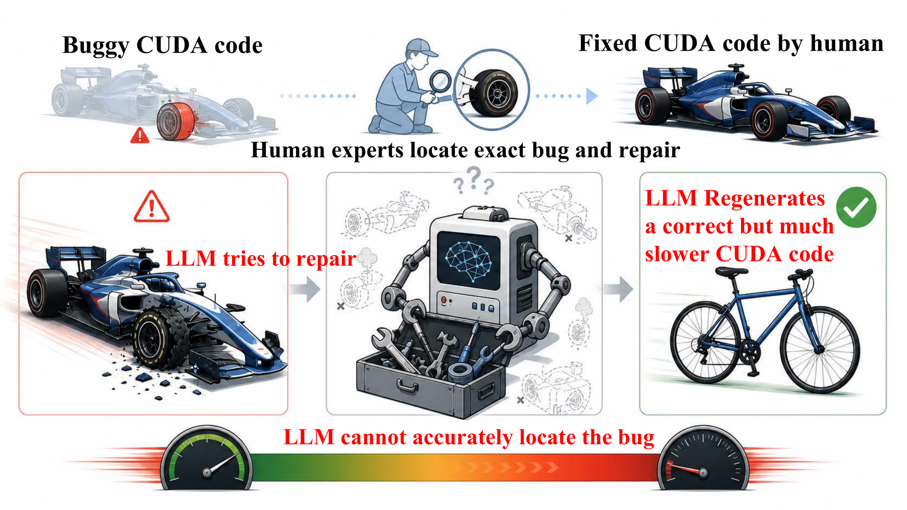

# CUDABeaver

<p align="center">
  
</p>

A benchmark of **213 broken CUDA kernels** paired with reference
implementations and runnable testbenches, designed to evaluate large
language model (LLM) debugging capability on GPU kernel code.

This single repository ships **everything** end-to-end:
- the 213-instance dataset under `data/` (broken_start + reference + testbench + per-instance metadata),
- the evaluation harness (`harness/`) that drives the gen → build → test → score loop,
- the analysis pipeline (`analysis/`) that produces every paper table,
- 238 evaluation configs (`configs/`) covering 5 axes (iter / repeated / feedback / history / fewshot),
- bundled CUTLASS + ThunderKittens headers (`data/_external/`) and a vendored copy of upstream KernelBench (`harness/_vendor/kernelbench/`) so reviewers don't need any external clones.

---

## Table of Contents

- [Quick start](#quick-start)
- [Repository layout](#repository-layout)
- [Dataset card](#dataset-card)
  - [Dataset summary](#dataset-summary)
  - [Supported tasks](#supported-tasks)
  - [Languages](#languages)
  - [Dataset structure](#dataset-structure)
  - [Dataset creation](#dataset-creation)
  - [Considerations for using the data](#considerations-for-using-the-data)
- [Setup](#setup)
- [Smoke test](#smoke-test)
- [Reproducing paper tables](#reproducing-paper-tables)
- [Family-specific runtime requirements](#family-specific-runtime-requirements)
- [What's NOT in the package](#whats-not-in-the-package)
- [Authors](#authors)
- [License](#license)

---

## Quick start

```bash
git clone <this-repo> cuda-debugger-bench
cd cuda-debugger-bench

# (A) pip + venv
bash setup_env.sh && source .venv/bin/activate
# OR (B) conda
# conda env create -f environment.yml && conda activate cuda-debugger-bench && bash scripts/post_conda_setup.sh

bash scripts/prepare_benchmark.sh
pytest tests/test_smoke.py -v
```

Then point a cfg's `llm:` block at your cloud-API or vLLM endpoint and run
`python -m harness.run_experiment --config configs/iter/<model>.yaml --mode debug`
(see [Reproducing paper tables](#reproducing-paper-tables)).

---

## Repository layout

```
harness/                   evaluation engine
  run_experiment.py          main entrypoint (gen → build → test → score)
  compiler.py                build dispatcher (nvcc / make / inline-cuda / class 2 runner)
  classifier.py              5-category outcome classifier
  feedback.py                Exp 3: feedback-level dispatcher (L0 … L4, error-aware modes)
  few_shot.py                Exp 7: in-context debug-pair retrieval
  benchmark.py               perf measurement orchestrator
  timing_modes/              5 timing backends (elapsed, kernels, applied-kernels, region, kernelbench)
  applied_kernels_eval.py    adapter for Class 2 def.py-based tasks
  applied_kernels_runner/    vendored class-1/2 backend (runner, eval, compiler, …)
  _vendor/kernelbench/       upstream KernelBench (MIT, ScalingIntelligence/KernelBench)
  llm_client.py              OpenAI-compatible cloud-API + vLLM client
  parallel_runner.py         per-task parallelism (N workers across N GPUs)
  queue_daemon.py            crash-safe queue daemon for long-batch sweeps
  references/schema.py       task / instance schema definitions

analysis/                  result aggregation
  scanner.py                 walks outputs/ and emits Run records
  pool.py                    per-task pooled metrics + 5-category counts
  axis_normalize.py          cfg basename → (model, axis, experiment) parser
  build_master.py            CLI: produces master.csv across all runs
  pivot_tables.py            CLI: paper tables + per-model summary + summary.md
  render_latex.py            booktabs LaTeX renderer

configs/                   238 evaluation configs across 5 axes
  iter/                      single-shot debug
  repeated/                  repeated@k vs iterative@k
  feedback/                  L0 (none) → L4 (oracle); + L3_raw + error-aware modes
  history/                   H1 … H4 multi-turn history rounds
  fewshot/                   in-context debug-pair retrieval

scripts/                   one-time setup + utilities
  prepare_benchmark.sh       materialize flat dataset layout (one-time, idempotent)
  post_conda_setup.sh        register vendored kernelbench in conda env (one-time)

data/                      dataset (213 instances)
  <instance_id>/             per-instance broken_start + reference + testbench + metadata
  _external/                 bundled CUTLASS (BSD-3) + ThunderKittens (MIT) headers

benchmark/                 legacy task-list manifest (used by --mode debug)
docs/                      PROTOCOL, PERF_PROTOCOL, REPRODUCE, ANONYMIZATION
tests/                     smoke + unit tests (no LLM key required)
examples/                  reproduction examples (see docs/REPRODUCE.md)

manifest.json              top-level index over the 213 instances
croissant.json             Croissant 1.0 metadata + 22 RAI fields (RAI 1.0)
README.md                  this file
LICENSE                    CC BY 4.0
```

---

## Dataset card

### Dataset summary

The benchmark consists of 213 instances across 11 task families spanning the
breadth of GPU programming workloads — from low-level cuBLAS / cuFFT /
cuSOLVER / cuSPARSE library calls to high-performance attention kernels
(FlashAttention, ThunderKittens) and CUTLASS GEMM tile schedules. Each
instance pairs an LLM-generated broken implementation with the canonical
reference and a runnable testbench that detects whichever of five failure
modes the bug induces (compile_error, logic_error, memory_crash, perf_broken,
timeout).

The intended use is **single-shot debugging evaluation** — given a broken
starting point and ground-truth context, can a model produce a corrected
implementation that passes the testbench? Multi-iteration variants
(repeated@k, iterative@k, history-augmented, feedback-graded, few-shot) are
described in the companion paper and supported by the released harness.

### Supported tasks

- **Code repair / Single-shot debugging**: Given a broken CUDA / inline-CUDA
  Python source plus a natural-language task description, generate a
  corrected implementation that satisfies the bundled testbench.
- **Iterative debugging**: Multi-turn dialogue variants where each
  iteration sees the prior failure log; supported by the harness's
  `feedback` and `history` axes.
- **Difficulty / family stratification**: Each instance carries a
  `task_family` and `error_category` label, enabling stratified analysis
  by kernel domain or failure mode.

The companion paper introduces the metric `pass@k` (with optional
performance gate `p`), defined as the probability that at least one of
`k` independently sampled solutions passes correctness AND achieves
`speedup ≥ p × reference_speed`.

### Languages

Code: CUDA C++ (`.cu`, `.cuh`, `.h`), Python (`.py`).
Natural-language prompts and task descriptions: English.

### Dataset structure

#### Data instances

One subdirectory per instance, named with the scheme:

```
<task_family_n>__<error_category>__<broken_start_hash8>
```

Examples: `cuda_104__compile_error__f8160fc8`,
`kernelbench_level1_16__logic_error__117b6454`,
`cutlass_00_basic_gemm__perf_broken__b536032b`.

Each subdirectory contains:

```
data/<instance_id>/
  broken_start.cu      LLM-generated buggy code (or .py / .h depending on family)
  reference.cu         Reference implementation that passes the testbench
  prompt.txt           User-facing task description shown to the LLM
  testbench/           Runnable build + correctness + performance harness
  input.json           build_command, test_command, schema metadata
  instance.json        Per-instance metadata (id, family, category, difficulty)
```

Top-level files:

```
data/_external/        Bundled CUTLASS + ThunderKittens headers (BSD-3 / MIT)
manifest.json          Index over all 213 instances (compact entry per instance)
croissant.json         Croissant 1.0 metadata + 22 RAI fields (RAI 1.0)
LICENSE                CC BY 4.0
```

#### Data fields

`instance.json` schema:

| Field | Type | Description |
|---|---|---|
| `id` | string | Globally unique instance ID (`<family_n>__<category>__<hash8>`) |
| `task_family` | string | One of 11 families (cuda, cutlass, cublas, …) |
| `error_category` | string | One of 5 (compile_error, logic_error, memory_crash, perf_broken, timeout) |
| `difficulty` | string | "easy", "medium", or "hard" |
| `upstream_library` | string | Source of the reference implementation (e.g. "NVIDIA cuBLAS", "ThunderKittens") |
| `broken_start_provenance` | string | Provenance of the broken starting code |
| `broken_start_lines` | integer | Line count of the broken source |
| `broken_start_hash` | string | First 16 hex chars of `sha256(broken_start)` |
| `files` | object | Per-file relative paths within the instance directory |

`input.json` schema: contains `build_command`, `test_command`, `solution_file`,
`level`, `tags`, plus a `hardware` block when the testbench has
architecture-specific requirements.

#### Data splits

The dataset is released as a **single split** (213 instances). The companion
paper evaluates each instance under multiple cfgs (iter, repeated, feedback
L0–L4, history H1–H4, fewshot K1–K5); these are evaluation axes, not
splits — every cfg sees the same 213 instances.

#### Composition

| Task family | n | Description |
|---|---|---|
| `cuda` | 49 | Curated standalone nvcc + thrust kernels |
| `cublas` | 3 | NVIDIA cuBLAS reference workloads |
| `cufft` | 2 | NVIDIA cuFFT reference workloads |
| `cufft_samples` | 9 | NVIDIA cuFFT sample C2C / R2C kernels |
| `cusolver` | 10 | NVIDIA cuSOLVER reference workloads |
| `cusparse` | 6 | NVIDIA cuSPARSE reference workloads |
| `cutlass` | 20 | CUTLASS GEMM / Conv / fusion examples |
| `flashattention` | 10 | FlashAttention-2 forward / backward / split kernels |
| `layernorm` | 16 | Forward / backward LayerNorm + parallel variants |
| `kernelbench` | 84 | KernelBench level-1 + level-2 PyTorch-extension kernels |
| `thunderkittens` | 4 | ThunderKittens linear-attn / mamba2 / based / flux kernels |

Error category distribution: `compile_error` 105, `logic_error` 45,
`perf_broken` 41, `memory_crash` 18, `timeout` 4.

### Dataset creation

#### Curation rationale

LLMs are increasingly deployed for low-level GPU programming, but standard
code-evaluation benchmarks measure code generation from scratch — not the
practical setting where a developer asks an LLM to fix existing broken code.
This benchmark fills that gap by providing 213 *real* failure modes
(generated by frontier LLMs themselves on GPU kernel tasks) paired with
ground-truth references and runnable testbenches.

#### Source data

**Initial Data Collection and Normalization** —
Broken starting code was collected by sampling the iter-1 outputs of a
committee of frontier LLMs on a curated pool of GPU kernel tasks (April
2026 – May 2026). For each (task, model) pair we kept the first iter-1
output exhibiting one of five target failure modes. Source LLM names are
aggregated into the `broken_start_provenance` field rather than reported
per-instance to avoid attributing specific failures to specific vendors.

Reference implementations are imported unmodified from public open-source
kernels (NVIDIA CUDA samples, CUTLASS examples, FlashAttention,
ThunderKittens, etc.). Each instance's `upstream_library` field records
the canonical source.

**Who are the source language producers?** —
LLM-generated broken code: anonymous frontier models from a multi-vendor
committee. Reference code: third-party open-source contributors per each
upstream project's git history.

#### Annotations

**Annotation process** — Each instance is automatically labeled with
`task_family` (from upstream project), `error_category` (5-bucket
classifier on raw build/test output), and `difficulty` (heuristic from
broken_start line count + reference complexity). No human annotators were
involved.

**Who are the annotators?** — Automated annotation only. The classifier
source is in `harness/classifier.py`.

#### Personal and Sensitive Information

None. The dataset contains only kernel source code, build commands, and
public-domain CUDA programming patterns. No PII, no user-identifying
data, no proprietary algorithms.

### Considerations for using the data

#### Social impact of dataset

Low risk. The benchmark targets a narrow technical domain (GPU kernel
programming) and contains no human-subject data. Potential positive
impacts include better evaluation of LLM debugging capability and faster
iteration on AI-assisted GPU programming tools.

#### Discussion of biases

- **Source-LLM bias**: Broken_starts inherit the failure-mode distributions
  of the source frontier models. Bug categories may be over-represented
  for common LLM errors (e.g., off-by-one indexing, missing
  `__syncthreads()`) and under-represented for rare ones.
- **Family imbalance**: KernelBench accounts for 84/213 (39%) of
  instances. Aggregate metrics should be reported with per-family
  stratification (the bundled harness does this by default).
- **Hardware bias**: All references were validated on NVIDIA Ampere
  (SM 80) and Blackwell (SM 120). Class-1 CUTLASS and ThunderKittens
  tasks may have arch-specific requirements documented in their
  testbench `Makefile`s.

#### Other known limitations

- **Single-iteration scope**: The dataset records broken_starts and
  references but not the multi-step debug history a developer might
  produce. The harness simulates iterative debugging on top of the
  static dataset.
- **Reference implementations may not be globally optimal**: References
  pass correctness and beat naive implementations, but newer
  hardware-specific optimizations may produce faster code.
- **Mid-2026 LLM snapshot**: Collected April–May 2026; LLM debug
  capabilities improve quickly, so absolute pass-rates will shift over
  time. Relative comparisons across cfgs (axes) remain meaningful.

A machine-readable Croissant 1.0 + RAI 1.0 metadata file with all 22
required fields is provided at `croissant.json` and validated by
`mlcroissant`.

---

## Setup

### Option A — pip + venv (recommended)

```bash
bash setup_env.sh
source .venv/bin/activate
bash scripts/prepare_benchmark.sh
```

`setup_env.sh` creates a venv from `requirements.txt` and registers the
vendored `kernelbench` package via a `.pth` so `import kernelbench` works.
`prepare_benchmark.sh` materializes the flat dataset layout the harness
expects (idempotent — re-runnable any time).

### Option B — conda

```bash
conda env create -f environment.yml
conda activate cuda-debugger-bench
bash scripts/post_conda_setup.sh
bash scripts/prepare_benchmark.sh
```

`environment.yml` pulls PyTorch + CUDA from the official `pytorch` and
`nvidia` channels for ABI alignment with the system `nvcc`. Adjust
`pytorch-cuda` if your toolkit version (12.x vs 13.x) differs.

### System prerequisites

- CUDA toolkit (`nvcc` ≥ 12.0; CUDA 13 is supported — see
  `docs/REPRODUCE.md` for the thrust-path note)
- A CUDA-capable GPU (SM ≥ 80)
- Python 3.10–3.12 (3.11 is the tested target)

---

## Smoke test

```bash
pytest tests/test_smoke.py -v
```

No LLM key required. Validates harness imports + classifier + bundled
fixture instance. Should complete in under 1 s.

---

## Reproducing paper tables

See **`docs/REPRODUCE.md`** for the full command sequence per paper table.
Quick sketch (Table 1, iter axis):

```bash
for cfg in configs/iter/*.yaml; do
  python -m harness.run_experiment \
    --config "$cfg" \
    --v2-task-list benchmark/task_list.json \
    --mode debug
done

python -m analysis.build_master  --results-root outputs --out-dir analysis_out
python -m analysis.pivot_tables  --in-dir analysis_out --out-dir analysis_out
```

`analysis_out/tables/exp1_iter.tex` matches paper Table 1.

### LLM endpoints — required swap

Each cfg's `llm:` block ships with placeholder `<CLOUD_API_BASE_URL>` +
`CLOUD_API_KEY`. Reviewers must point these at their own infrastructure
(any OpenAI-compatible cloud API or a self-hosted vLLM server). See
`docs/REPRODUCE.md § LLM endpoints` for details.

---

## Family-specific runtime requirements

All required code/headers are bundled — most instances build with just
`nvcc`. Per-family detail:

| Family                                  | n  | Bundled at                                          |
|-----------------------------------------|----|-----------------------------------------------------|
| cuda, cublas, cufft, cusolver, cusparse | 70 | (nvcc only)                                         |
| cutlass                                 | 20 | `data/_external/cutlass`                            |
| thunderkittens                          |  4 | testbench self-contained + bundled fallback         |
| kernelbench                             | 84 | `harness/_vendor/kernelbench/` (registered via .pth)|
| flashattention, layernorm, cufft_samples| 35 | `harness/applied_kernels_runner/` + reference_sources |

**Total: 213 instances**, 100% buildable on CUDA 12 or 13 (see the
build-audit table in `docs/REPRODUCE.md`).

---

## What's NOT in the package

- Paper-side `outputs/` directories (reviewer-side, regenerated per run)
- API keys / `.env` / scratch caches
- Profiler dumps (`*.nsys-rep`, `*.ncu-rep`)

---

## Authors

Anonymous Authors (NeurIPS 2026 D&B Track submission). Will be deanonymized
on acceptance. Until then, please address inquiries through the OpenReview
submission page.

---

## License

The benchmark + harness + analysis code is released under **CC BY 4.0**
(see `LICENSE`).

Bundled third-party packages keep their own licenses:

- `harness/_vendor/kernelbench/` — MIT, see
  `harness/_vendor/kernelbench/LICENSE.txt`
- `data/_external/cutlass/` — BSD 3-Clause License (NVIDIA Corporation),
  see `data/_external/cutlass/LICENSE.txt`
- `data/_external/ThunderKittens/` — MIT License (HazyResearch), see
  `data/_external/ThunderKittens/LICENSE.txt`

